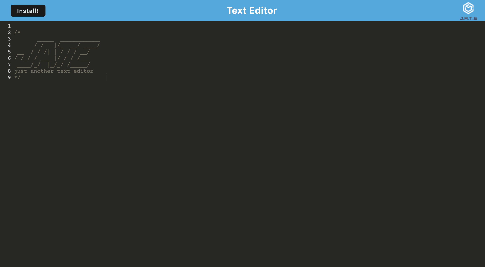

# 🗒 Text Editor (J.A.T.E)
This is a text editor that is downloadable for use on the web or in your desktop, it saved automatically.

## 🛠 Tools

- Expresss
- If-env
- Concurrently
- Nodemon
- code-mirror-themes
- idb

## 🚀 Deployment
https://text-editor-johan.herokuapp.com/

## 📸 Screen Shots

## Author

- [@Johanh0](https://www.github.com/johanh0)

## Support or contact

For support or if you wish contact me please, email me to [johanherrera20000@gmail.com](mailto:johanherrera20000@gmail.com).